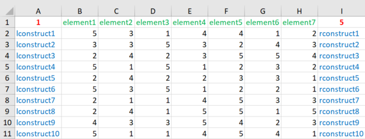

```{r echo=FALSE, message=FALSE, warning=FALSE}
knitr::opts_chunk$set(collapse = TRUE, comment = "#")
library(OpenRepGrid)
settings(show.scale = FALSE, show.meta = FALSE)
```


The `OpenRepGrid` R package is able to read files from different other grid programs as well as standard formats (i. e. `.txt`, `.xlsx`). All import functions follow the same naming scheme. They start with the word `import` followed by the program the file is imported from, e.g. `Gridstat`. Hence the function to import a Gridstat file is called `importGridstat`.


### Loading OpenRepGrid files


#### Microsoft Excel files

You can define a grid file using Microsoft Excel. The `.xlsx` file has to be in a fixed format. See an example of a correct file below. The first row contains the minimum of the rating scale (red), the names of the elements (green) and the maximum of the rating scale (red). Below, every row contains the left construct pole (blue), the ratings (black) and the right construct pole (blue).  




To load the `.xlsx` file and save it into the object `x` type the following code to the R console.

```{r eval=FALSE}
x <- importExcel("example.xlsx")
```

The `OpenRepGrid` package comes with an example Excel file. If you have Excel installed, you should be able to open it by typing

```{r eval=FALSE}
file <- system.file("extdata", "excel_grid_001.xlsx", package = "OpenRepGrid")
system2("open", file)
```


#### .txt files

If you do not have a grid program at hand you can define a grid using a standard text editor and by saving it as a `.txt` file. The `.txt` file has to be in a fixed format. There are three mandatory blocks each starting and ending with a predefined tag in uppercase letters. The first block starts with `ELEMENTS` and ends with `END ELEMENTS` and contains one element in each line. The other mandatory blocks contain the constructs and ratings (see below). In the block containing the constructs the left and right pole are seperated by a colon (`:`). The order of the blocks is arbitrary. All text not contained within the blocks is discarded and can thus be used for comments.

    ------------ example.txt file ---------------
    
    anything not contained within the tags will be discarded
    
    ELEMENTS
    element 1
    element 2
    element 3
    END ELEMENTS
    
    CONSTRUCTS
    left pole 1 : right pole 1
    left pole 2 : right pole 2
    left pole 3 : right pole 3
    left pole 4 : right pole 4
    END CONSTRUCTS
    
    RATINGS
    1 3 2
    4 1 1
    1 4 4
    3 1 1
    END RATINGS
    
    RANGE
    1 4
    END RANGE
    ---------------- end of file ----------------

To load the `.txt` file and save it into the object `x` type the following code to the R console.

```{r eval=FALSE}
x <- importTxt("example.txt")
```

You have to make sure, that the file exists in the current working directory. If not you either have to specify the whole path to the file or you must change the R working directory.

```{r eval=FALSE}
x <- importTxt("markheckmann/data/examples.txt") # whole path to file or
getwd() # show current working directory
setwd("markheckmann/data") # change working directory to the folder markheckmann/data
x <- importTxt("example.txt") # load file that is in the current working directory
```

Another option that is available for all import functions is to supply no argument inside the brackets. In this case an interactive file selection dialog will open.

```{r eval=FALSE}
x <- importTxt() # without any arguments
```

This will open a dialog window which allows you to select a file manually.


### Import files from other grid programs

To import from other grid programs works the same as importing a `.txt` file. Either you specify the file name if it resides in the current R working directory, you supply the whole file path if it is not in the current directory or you do not supply any argumnets and and interactive file selection dialog window will open.

#### Gridcor

```{r eval=FALSE}
x <- importGridcor("gridcor.dat") # file in current R working directory or
x <- importGridcor("markheckmann/data/gridcor.dat") # whole file path or
x <- importGridcor() # open file selection dialog
```


#### Gridstat
 
```{r eval=FALSE}
x <- importGridstat("gridstat.dat") # file in current R working directory or
x <- importGridstat("markheckmann/data/gridstat.dat") # whole file path or
x <- importGridstat() # open file selection dialog
```


#### GridSuite

```{r eval=FALSE}
x <- importGridsuite("gridsuite.xml") # file in current R working directory or
x <- importGridsuite("markheckmann/data/gridsuite.xml") # whole file path or
x <- importGridsuite() # open file selection dialog
```


#### sci:vesco

```{r eval=FALSE}
x <- importScivesco("scivesco.scires") # file in current R working directory or
x <- importScivesco("markheckmann/data/scivesco.scires") # whole file path or
x <- importScivesco() # open file selection dialog
```


### Saving grids

`OpenRepGrid` can currently save grids in two formats. Either as a `.txt` file or as an R data object.

#### .txt file

To save a grid as a `.txt` file use the function `saveAsTxt`. It will save the grid as a .txt file in format used by `OpenRepGrid`. This file format can also easily be edited by hand (see `importTxt` for a description). The function will open an interactive dialog box to let the user enter a filename if no file argument is supplied in the function call. Let's suppose we want to strore the `boeker` grid.

```{r eval=FALSE}
saveAsTxt(boeker, "boeker.txt") # save it to the file "boeker.txt"
saveAsTxt(boeker) # open a dialog box to enter the file name interactively
```


#### R data object

Another option is to save the grid as an `RData` object. This is done by using the function save.

```{r eval=FALSE}
save(boeker, file = "boeker.RData") # save it to the file "boeker.RData"
```

In future versions of OpenRepGrid will also support the `.xml` format once a community standard has been agreed upon.
