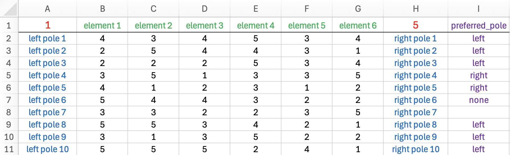

```{r echo=FALSE, message=FALSE, warning=FALSE}
knitr::opts_chunk$set(collapse = TRUE, comment = "#")
library(OpenRepGrid)
settings(show.scale = FALSE, show.meta = FALSE)
```


The `OpenRepGrid` R package is able to read files from different other grid programs as well as standard formats (i. e. `.txt`, `.xlsx`). All import functions follow the same naming scheme. They start with the word `import` followed by the program the file is imported from, e.g. `Gridstat`. Hence the function to import a Gridstat file is called `importGridstat`.

### Loading OpenRepGrid files

#### Microsoft Excel files

You can define a grid file using Microsoft Excel. The `.xlsx` file has to be in a fixed format. See an example of a correct file below. The first row contains the minimum of the rating scale (red), the names of the elements (green) and the maximum of the rating scale (red). Below, every row contains the left construct pole (blue), the ratings (black) and the right construct pole (blue). The rightmost columns (purple) is optional and contains the preferred pole. Allowed values are 
`left`, `right`, `none` or an empty cell.



To load an `.xlsx` file and save it into the object `x` type the following code to the R console (assuming your file is
named `sample.xlsx`).

```{r eval=FALSE}
x <- importExcel("sample.xlsx")
```

The `OpenRepGrid` package comes with an example Excel file. If you have Excel installed, you should be able to open it
by typing

```{r eval=FALSE}
file <- system.file("extdata", "grid_01.xlsx", package = "OpenRepGrid")
browseURL(file) # may not work on all systems
```

#### .txt files

If you do not have a grid program at hand you can define a grid using a standard text editor and by saving it as a
`.txt` file. The `.txt` file has to be in a fixed format. There are three mandatory blocks each starting and ending
with a predefined tag in uppercase letters. The first block starts with `ELEMENTS` and ends with` ⁠END ELEMENTS`⁠. It
contains one element per line. The other mandatory blocks are `CONSTRUCTS` and `RATINGS` (see below). In the block
containing the constructs the left and right pole are separated by a colon (:). To define missing values use NA. The
block `PREFERRED` is optional. Each line indicated the preferred construct pole. Allowed values are left, right, none (no
pole preferred), and NA (unknown). The block RANGE is optional but recommended. It gives the rating scale range defined
by two numbers. The order of the blocks is arbitrary. All text outside the blocks is discarded and can be used for
comments.

    ---------------- sample .txt file -------------------

    Note: anything outside the tag pairs is discarded

    ELEMENTS
    element 1
    element 2
    element 3
    END ELEMENTS
    
    CONSTRUCTS
    left pole 1 : right pole 1
    left pole 2 : right pole 2
    left pole 3 : right pole 3
    left pole 4 : right pole 4
    END CONSTRUCTS
    
    PREFERRED
    left
    left
    right
    none
    END PREFERRED
    
    RATINGS
    1 3 2
    4 1 1
    1 4 4
    3 1 1
    END RATINGS
    
    RANGE
    1 4
    END RANGE
    
    ------------------ end of file ------------------

To load the `.txt` file and save it into the object `x` type the following code to the R console.

```{r eval=FALSE}
x <- importTxt("example.txt")
```

You have to make sure, that the file exists in the current working directory. If not you either have to specify the whole path to the file or you must change the R working directory. A sample `.txt` file is also contained in the package. The `OpenRepGrid` package comes with an sample `.txt` file. You can load it as follows.

```{r eval=FALSE}
file <- system.file("extdata", "grid_01.txt", package = "OpenRepGrid")
x <- importTxt(file)
```

To open the sample `.txt` file try:

```{r eval=FALSE}
browseURL(file) # may not work on all systems
```

#### Convert a dataframe into a grid

Sometimes, you may want to convert data you loaded elsewhere into a repgrid. A dataframe is a central R data structure and 
can easily be converted into a `repgrid` object using `importDataframe`. Please have a look at the docs for details (`?importDataframe`). The 
package comes with several sample dataframes, for example, `df_element_columns`. You can import it as follows.

```{r eval=FALSE}
importDataframe(df_element_columns)
```


### Import files from other grid programs

To import from other grid programs works the same as importing a `.txt` file. Either you specify the file name if it resides in the current R working directory, you supply the whole file path if it is not in the current directory.

#### Gridcor

```{r eval=FALSE}
x <- importGridcor("gridcor.dat") # file in current R working directory
```


#### Gridstat
 
```{r eval=FALSE}
x <- importGridstat("gridstat.dat") # file in current R working directory
```


#### GridSuite

```{r eval=FALSE}
x <- importGridsuite("gridsuite.xml") # file in current R working directory
```


#### sci:vesco

```{r eval=FALSE}
x <- importScivesco("scivesco.scires") # file in current R working directory 
```


### Saving grids

`OpenRepGrid` can currently save grids in several formats. Either as a `.txt` file or as an R data object.

#### Excel file

The most convenient format is probably an Excel file. You can save one or more grids to Excel using `saveAsExcel`.

```{r eval=FALSE}
saveAsExcel(boeker, file = "boeker.xlsx") # save it to the file "boeker.xlsx"
```

#### .txt file

To save a grid as a `.txt` file use the function `saveAsTxt`. It will save the grid as a .txt file in format used by `OpenRepGrid`. This file format can also easily be edited by hand (see `importTxt` for a description).

```{r eval=FALSE}
saveAsTxt(boeker, "boeker.txt") # save it to the file "boeker.txt"
```


#### R data object

Another option is to save the grid as an `RData` object. This is done by using the function `save`.

```{r eval=FALSE}
save(boeker, file = "boeker.RData") # save it to the file "boeker.RData"
```
